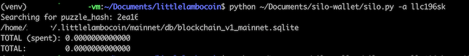
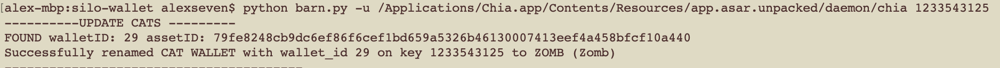

# silo-wallet

# Silo ( aka "show your cold wallet balance" tool )
Quickly look up your Chia fork/altcoin wallet balance using your cold wallet public key.

## Usage
`python silo.py -a <your cold wallet address>`
OR
`python3 silo.py -a <your cold wallet address>`

  
Silo Wallet - click to expland

  ## Which Chia fork/altcoin is supported?
  Every one of them. If you run the full node of the Chia fork/altcoin then you can use this tool to look up your balance.
  You can see the currently known forks in the `blockchains.yaml` alternativelly run to see the same list:
  
  ### Adding new fork support
  Note: I'll do my best to keep up with all the forks but this is how you can do it:

  1. Open `blockchains.yaml`
  1. Add your token + data directory in the same format as the rest of the forks.
  1. `python silo.py -l` to verify

  ## Install/Requirements
  Requires Python 3.6+ and familiarity with CLI. Tested and working on 
  * Ubuntu 20.04 LTS
  * macOS 10.15.7
  * Windows 10

  ### Install Option A:
  `git clone https://github.com/scotopic/silo-wallet;cd silo-wallet;python silo.py -h`

  ### Install Option B:
  1. Download .zip/.tar.gz from https://github.com/scotopic/silo-wallet/releases/
  1. Extract
  1. `python silo.py -h`
   * if you run into `ModuleNotFounderror: No module named "yaml"` then run `pip install pyyaml`

  ## Usage
  `python silo.py -a <your cold wallet address>`
  OR
  `python3 silo.py -a <your cold wallet address>`

---

# Barn ( aka "herd/rename CATs" tool )
Quickly add Chia Asset Token names to your light wallet.
Assumes the light wallet is synced and tested with Chia Light Wallet 1.2.11 (that shows CAT WALLET by default)

## Usage
`python barn.py -u <your Chia light wallet executable path> <wallet fingerprint>`

---

## Support
Found this project useful? Send your donation to support the project's further development

* XCH: xch1w3c2nkkfh990qwvejlkj94f75cfy5fk2ecj3v2c7ja0xfxrzmgwst32tle
* HDD: hdd1cf7p8ja3zt4x2temwj0czq4safeze0excsju640q7fw8e6myrphsnx3afh
* ETH: 0x7f9F5Fd62E97B8Ed490B464CF710B45054720b92
* BTC: bc1q6k6tgj2nmyu44fwvut8hfh0dzht53a2nzaajve

* Chia CATs: xch1n48fpuzq3dpx8lv85vq5zqsyam07cpy3uujpe9x60a6r5wkd23kq34yrn8

## Feedback/Contribution
* Create a GitHub issue.
* Join my discords: 
   * Scotopic:    https://discord.gg/pgNRPS2Zfd
   * Silo Wallet: https://discord.gg/YrFqcR7qxZ
